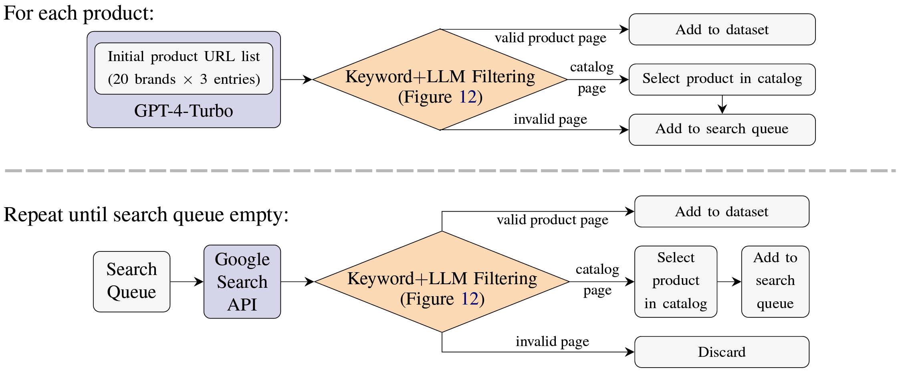

## The *RAGDOLL* E-Commerce Webpage Dataset

This repository contains the ***RAGDOLL*** (Retrieval-Augmented Generation Deceived Ordering via AdversariaL materiaLs) dataset as well as its LLM-automated collection pipeline.

The ***RAGDOLL*** dataset is from the paper [*Ranking Manipulation for Conversational Search Engines*](https://arxiv.org/pdf/2406.03589) from Samuel Pfrommer, Yatong Bai, Tanmay Gautam, and Somayeh Sojoudi. For experiment code associated with this paper, please refer to [this repository](https://github.com/spfrommer/cse-ranking-manipulation).

The dataset consists of 10 product categories (see [`dataset/categories.md`](https://github.com/spfrommer/ragdoll-data-pipeline/blob/main/dataset/categories.md)), with at least 8 brands for each category and 1-3 products per brand, summing to 1147 products in total. The evaluations in our paper are performed with a balanced subset with precisely 8 brands per category and 1 product per brand.

The URLs of the full 1147 products are shared at [`dataset/webpage_links`](https://github.com/spfrommer/ragdoll-data-pipeline/tree/main/dataset/webpages_links). We additionally share the downloaded webpages associated with the data subset used in our paper at [`dataset/final_dataset.zip`](https://github.com/spfrommer/ragdoll-data-pipeline/tree/main/dataset/final_dataset.zip) for reproducibility.

**Update July 24:** RAGDOLL has been added to [Huggingface🤗 Datasets](https://huggingface.co/datasets/Bai-YT/RAGDOLL)


### Description

The work [*Ranking Manipulation for Conversational Search Engines*](https://arxiv.org/pdf/2406.03589) investigates the impact of prompt injections on the ranking order of sources referenced by Large Language Model (LLM)-powered conversational search engines. It finds that in the absence of adversarial injections, different LLMs vary significantly in prioritizing product names, document contents, and context positions. Furthermore, jailbreaking techniques can reliably promote low-ranked products.

For experimental evaluation, we collect a focused dataset of real-world consumer product websites and formalize conversational search ranking as an adversarial problem, and refer to it as the ***RAGDOLL*** dataset.


### Dataset Collection Pipeline

<p align="center">
    
</p>

This collection pipeline of the ***RAGDOLL*** dataset consists of the following two main steps:
- Gather an initial list of products with GPT-4-Turbo or 4o.
- LLMs are good at coming up with a list of products, but are not good at providing functional links. Hence, we use a combination of the Google Search API and GPT-3.5-Turbo to clean the data and verify/update the product URLs.

As of the completion of our data collection, Google Cloud offers a $300 search API credit for each new user.

When downloading webpages, it is highly recommended to download *dynamic* pages (i.e., after JavaScript execution), as the static raw HTML often misses lots of crucial information, such as price and availability. To download dynamic pages, use one of the following two methods:
- Use the `selenium` package to invoke web browsers (faster, more up-to-date).
- Download from CommonCraw (slower, more reproducible).

The downloading method is controlled with [`cc_fetch`](https://github.com/spfrommer/ragdoll-data-pipeline/blob/11c54ca77029a743ada72a2548df2b3a86262bc7/utils/query_utils.py#L39).


### Collecting Your Own Dataset

You can use this data collection pipeline to collect additional websites or additional product categories. To do so, modify [`dataset/categories`](https://github.com/spfrommer/cse-ranking-manipulation) accordingly and run the code with the following instructions.

Required packages:
```
click pandas torch requests bs4 lxml unidecode selenium openai cdx_toolkit
```

To query GPT-4-Turbo to collect a set of brands and products, run
```
python find_sites.py --model "gpt-4-turbo"
# feel free to replace with gpt-4o
```

To clean the dataset (with Google Search API and GPT-3.5-Turbo), run
```
python clean_sites.py --max_workers <CPU_THREADS_TO_USE>
```

Website HTMLs, Google CSE search responses, and OpenAI LLM responses will be cached.


### Citation

```bibtex
@article{pfrommer2024ranking,
  title={Ranking Manipulation for Conversational Search Engines},
  author={Pfrommer, Samuel and Bai, Yatong and Gautam, Tanmay and Sojoudi, Somayeh},
  journal={arXiv preprint arXiv:2406.03589},
  year={2024}
}
```
